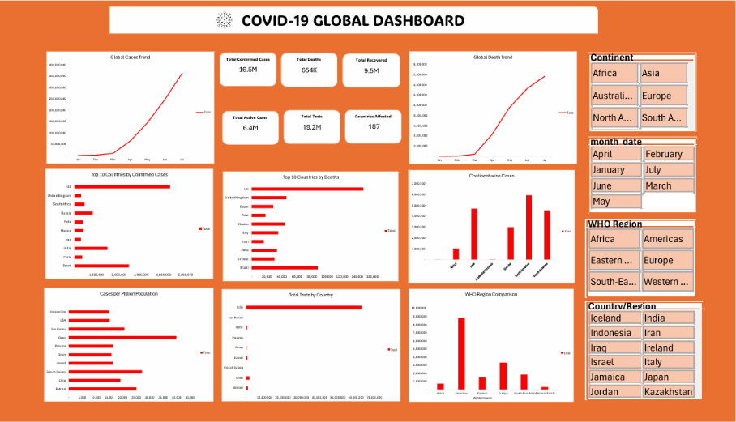

# 🌍 COVID-19 Data Analysis Dashboard | Microsoft Excel & Power Query

## 📌 Project Overview

The **COVID-19 Data Analysis Dashboard** is an end-to-end data analytics project developed using **Microsoft Excel** and **Power Query**. The project focuses on analyzing global COVID-19 data to identify trends in confirmed cases, deaths, recoveries, testing, and regional impact through interactive dashboards and visualizations.

The dataset was sourced from **Kaggle** and transformed into actionable business-style insights using data cleaning, analysis, and dashboard development techniques.

This project demonstrates the complete analytics workflow, from importing raw CSV data to creating an interactive reporting dashboard.

---

# 🎯 Project Objectives

The primary objectives of this project were to:

- Analyze the global spread of COVID-19.
- Compare confirmed cases, deaths, and recoveries across countries.
- Monitor regional and continental trends.
- Identify the most affected countries.
- Develop an interactive dashboard for data exploration and reporting.

---

# 🛠 Tools & Technologies

- Microsoft Excel
- Power Query
- Pivot Tables
- Pivot Charts
- Excel Formulas
- Slicers
- Map Chart
- Dashboard Design

---

# 📥 Data Collection

The dataset was obtained from **Kaggle** in CSV format.

The raw data was imported into Microsoft Excel using the **Get Data** feature and loaded into **Power Query** for data cleaning and transformation.

---

# 🧹 Data Cleaning & Transformation

The dataset was prepared using **Power Query** before analysis.

The following transformations were performed:

- Removed duplicate records
- Changed data types
- Cleaned and formatted text values
- Handled missing or inconsistent data where applicable
- Prepared the dataset for analysis
- Loaded the transformed data into Microsoft Excel

---

# 📊 Data Analysis

The cleaned dataset was analyzed using Pivot Tables and Excel's analytical features to understand the global impact of COVID-19.

The analysis focused on:

- Total Confirmed Cases
- Total Deaths
- Total Recoveries
- Active Cases
- Country-wise Analysis
- Continent / WHO Region Comparison
- Monthly Trend Analysis
- Top Affected Countries

---

# 📈 Dashboard Features

The dashboard provides an interactive overview of COVID-19 statistics through the following components:

### Key Performance Indicators (KPIs)

- Total Confirmed Cases
- Total Deaths
- Total Recoveries
- Active Cases

### Interactive Filters

- Year
- Month
- WHO Region
- Country

### Visualizations

- Global Cases Trend
- Death Trend
- Country-wise Comparison
- Top 10 Countries by Confirmed Cases
- Cases by WHO Region / Continent
- Geographic Distribution (Map Chart)

The interactive slicers enable users to explore COVID-19 statistics across different countries, regions, and time periods.

---

# 💼 Business Questions Addressed

This dashboard helps answer important analytical questions, including:

- Which countries reported the highest number of confirmed cases?
- Which regions were most affected?
- How did confirmed cases change over time?
- What is the relationship between confirmed cases, deaths, and recoveries?
- Which countries experienced the highest mortality?
- How did COVID-19 impact different parts of the world?

---

# 📌 Key Insights

The analysis provides valuable insights, including:

- Identification of countries with the highest confirmed cases.
- Comparison of death and recovery rates across regions.
- Visualization of global COVID-19 trends over time.
- Regional analysis using WHO classifications.
- Interactive exploration of pandemic statistics through filters and dashboards.

---

# 💡 Skills Demonstrated

This project demonstrates practical experience in:

- Data Cleaning
- Data Transformation
- Power Query
- Data Analysis
- Dashboard Development
- Data Visualization
- KPI Reporting
- Pivot Tables
- Pivot Charts
- Interactive Reporting
- Analytical Thinking

---

# 📷 Dashboard Preview

---

# 📁 Dataset

The dataset used in this project was sourced from **Kaggle** and contains global COVID-19 statistics for educational and analytical purposes.

---

# 🚀 Learning Outcomes

Through this project, I gained practical experience in:

- Importing CSV datasets using Power Query
- Cleaning and transforming large datasets
- Building interactive dashboards in Microsoft Excel
- Analyzing global health data
- Creating KPI-driven reports and visualizations
- Presenting analytical insights through dashboards

