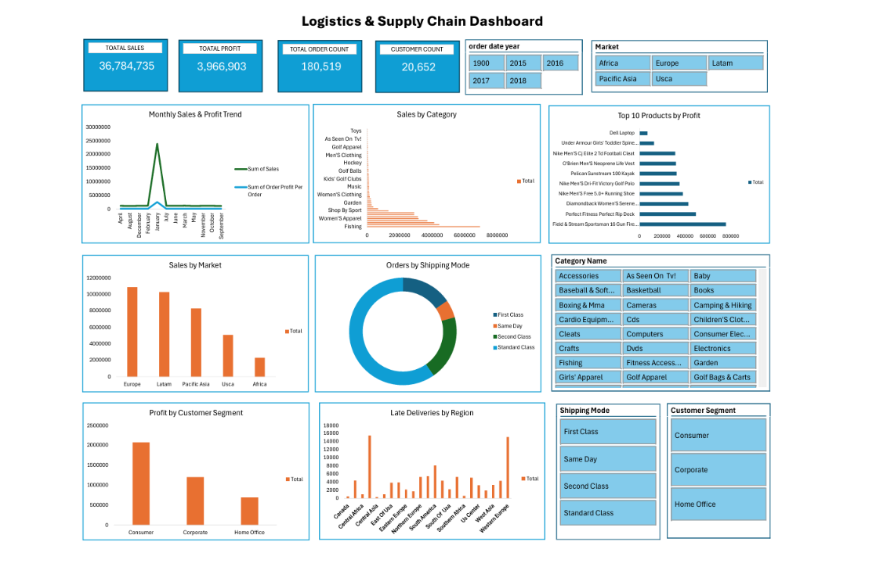

# 🚚 Logistics & Supply Chain Analysis Dashboard | Microsoft Excel & Power Query

## 📌 Project Overview

The **Logistics & Supply Chain Analysis Dashboard** is an end-to-end business intelligence project developed using **Microsoft Excel** and **Power Query**. The project focuses on analyzing supply chain operations by transforming raw logistics data into meaningful business insights through interactive dashboards and data visualization.

The dataset used in this project was sourced from **Kaggle** and contains information related to customer orders, products, shipping methods, markets, profits, and delivery performance.

This project demonstrates the complete data analytics workflow, including data import, cleaning, transformation, analysis, and dashboard development.

---

# 🎯 Project Objectives

The primary objectives of this project were to:

- Analyze overall supply chain performance.
- Identify top-performing products and markets.
- Evaluate customer profitability.
- Monitor shipping and delivery performance.
- Develop an interactive dashboard to support business decision-making.

---

# 🛠 Tools & Technologies

- Microsoft Excel
- Power Query
- Pivot Tables
- Pivot Charts
- Excel Formulas
- Slicers
- Dashboard Design

---

# 📥 Data Collection

The dataset was obtained from **Kaggle** in **CSV format**.

The raw CSV file was imported into Microsoft Excel using the **Get Data** feature and loaded into **Power Query** for preprocessing and transformation.

---

# 🧹 Data Cleaning & Transformation

Data preparation was performed using **Power Query** to improve data quality and prepare the dataset for analysis.

The following cleaning and transformation tasks were completed:

- Removed duplicate records
- Split columns into meaningful fields
- Corrected data types
- Formatted text values
- Removed unnecessary columns
- Standardized column formatting
- Created a clean analytical dataset
- Loaded the transformed data into Microsoft Excel

The cleaned dataset was then used for further analysis and dashboard creation.

---

# 📊 Data Analysis

The transformed dataset was analyzed using Pivot Tables and Excel's analytical features to identify operational trends and business performance.

The analysis focused on:

- Total Sales
- Total Profit
- Total Orders
- Customer Count
- Monthly Sales & Profit Trend
- Product Category Performance
- Market-wise Sales
- Shipping Mode Analysis
- Late Delivery Analysis
- Customer Segment Profitability
- Product Profitability

---

# 📈 Dashboard Features

The dashboard includes the following interactive KPIs and visualizations:

### Key Performance Indicators

- Total Sales
- Total Profit
- Total Order Count
- Customer Count

### Interactive Filters

- Order Year
- Market
- Customer Segment
- Shipping Mode
- Category Name

### Visualizations

- Monthly Sales & Profit Trend
- Sales by Category
- Sales by Market
- Orders by Shipping Mode
- Late Deliveries by Region
- Profit by Customer Segment
- Top 10 Products by Profit

The dashboard allows users to interactively filter data and explore operational performance across multiple business dimensions.

---

# 💼 Business Questions Addressed

This dashboard helps answer important business questions such as:

- Which markets generate the highest sales?
- Which product categories contribute the most revenue?
- Which products generate the highest profit?
- Which customer segment is the most profitable?
- Which shipping methods are used most frequently?
- Which regions experience the highest number of late deliveries?
- How do sales and profits change over time?
- What are the overall sales, profit, and order performance metrics?

---

# 📌 Key Insights

The analysis provides valuable business insights, including:

- Identification of high-performing markets and product categories.
- Recognition of the most profitable products.
- Comparison of profitability across customer segments.
- Evaluation of shipping preferences and delivery performance.
- Detection of regions with higher late delivery rates.
- Monthly sales and profit trends for performance monitoring.

These insights can help organizations optimize inventory planning, improve logistics operations, enhance customer satisfaction, and support strategic business decisions.

---

# 💡 Skills Demonstrated

This project demonstrates practical experience in:

- Data Cleaning
- Data Transformation
- Power Query
- Data Analysis
- Dashboard Development
- Data Visualization
- Business Intelligence
- KPI Reporting
- Pivot Tables
- Pivot Charts
- Supply Chain Analytics
- Logistics Performance Analysis

---

# 📷 Dashboard Preview

---

# 📁 Dataset

The dataset used in this project was sourced from **Kaggle** and contains logistics and supply chain transaction data for educational and analytical purposes.

The dataset includes information related to:

- Orders
- Products
- Customers
- Markets
- Shipping Modes
- Sales
- Profit
- Delivery Status

---

# 🚀 Learning Outcomes

Through this project, I gained practical experience in:

- Importing CSV data using Power Query
- Cleaning and transforming large datasets
- Performing supply chain and logistics analysis
- Building interactive dashboards in Microsoft Excel
- Developing KPI-based business reports
- Converting operational data into actionable business insights

